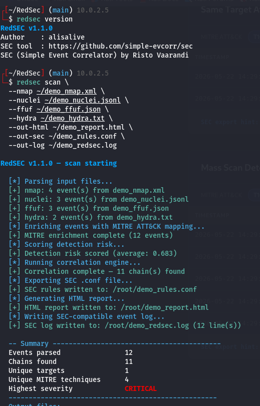
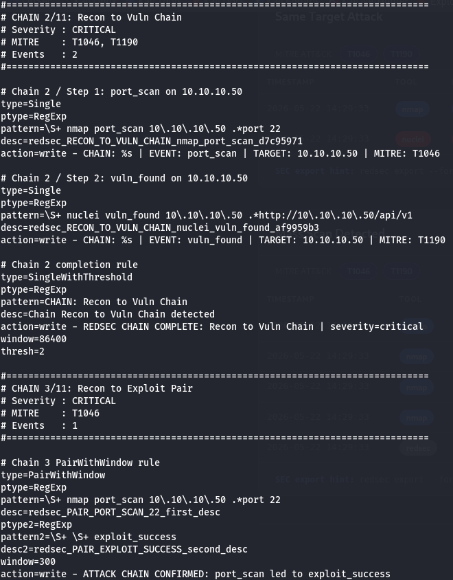
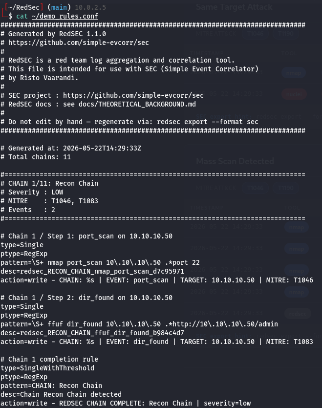
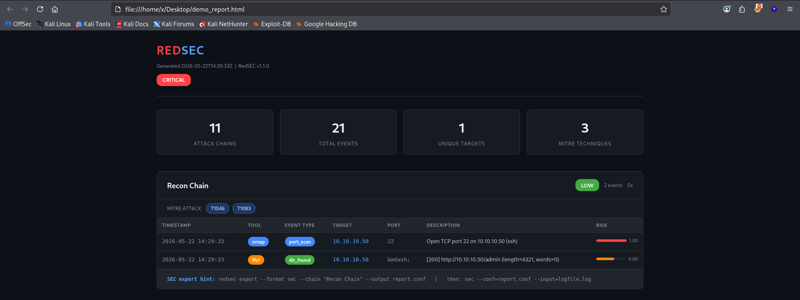
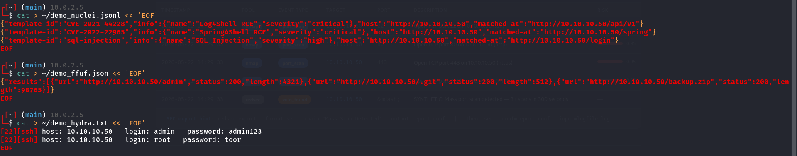
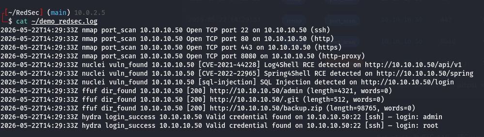
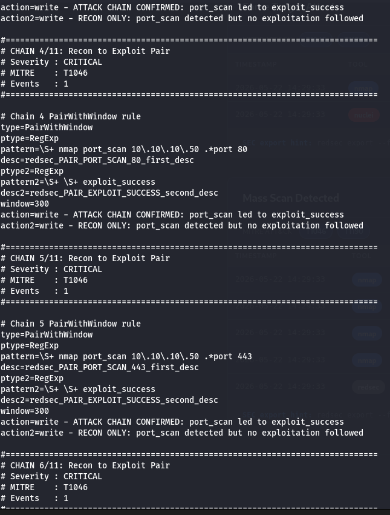

# RedSEC

**Red team log aggregation, correlation, and SEC export tool.**

---

## Why RedSEC?

During red team engagements, I kept running into the same problem:
nmap outputs XML, nuclei outputs JSONL, ffuf outputs JSON — all
scattered across different terminals and files. Writing the final
pentest report meant manually piecing together what happened, when,
and in what order.

I wanted a tool that would automatically collect all of that output,
correlate events into attack chains, and produce something useful —
both for my own reporting and for the defender who needs to understand
what they missed.

The SEC integration came from reading Risto Vaarandi's 2002 IEEE paper
on Simple Event Correlator. Vaarandi built SEC for defenders — to
correlate log events and detect attack patterns. I thought: what if
we feed offensive tool output into SEC? What if a red teamer's logs
could directly tell a defender "here is what I did, and here is the
SEC rule that would have caught me"?

That question became RedSEC.

SEC project: https://github.com/simple-evcorr/sec

---

## Features

- 9 tool parsers — nmap, subfinder, ffuf, feroxbuster, nuclei, sqlmap, hydra,
  metasploit, impacket
- YAML-based attack chain correlation — rules match event sequences within
  configurable time windows
- MITRE ATT&CK mapping — every event automatically enriched with technique ID
  and tactic name
- Detection risk heuristic — score (0.0 to 1.0) estimates SOC detection
  likelihood per event based on tool, event type, and port
- SEC export — generates .conf files with 5 rule types: Single,
  SingleWithThreshold, PairWithWindow, Context, and Synthetic rules,
  consumable directly by Vaarandi's SEC daemon
- HTML report — dark-theme timeline with severity badges, MITRE technique tags,
  and detection risk bars; no external dependencies
- LogZilla HTTP Event Receiver export — push events directly to LogZilla or
  write LogZilla-formatted JSON lines to a file
- Cross-platform — Windows, Linux, macOS

---

## Installation

    git clone https://github.com/alisalive/RedSEC
    cd RedSEC
    pip install -e .

---

## Usage

Basic scan with nmap and nuclei output:

    redsec scan --nmap scan.xml --nuclei findings.jsonl --out-log redsec.log

Full pipeline with multiple tools and all outputs:

    redsec scan \
      --nmap scan.xml \
      --subfinder subs.json \
      --ffuf dirs.json \
      --nuclei vulns.jsonl \
      --hydra creds.txt \
      --out-html report.html \
      --out-sec rules.conf \
      --out-log redsec.log

Print version and SEC tool reference:

    redsec version

---

## How It Works

    Tool output files
          |
          v
    Parsers (per-tool)          -- normalize to RedSecEvent
          |
          v
    MitreMapper                 -- enrich with T-ID and tactic
          |
          v
    DetectionScorer             -- assign risk score 0.0-1.0
          |
          v
    CorrelationEngine           -- match YAML rules -> AttackChains
          |
          v
    SecExporter                 -- write .conf (Single, SingleWithThreshold, PairWithWindow, Context, Synthetic rules)
    HtmlExporter                -- write dark-theme HTML report
    JsonExporter                -- write raw JSON (optional)

---

## Screenshots

---

## SEC Integration

RedSEC exports attack chains as .conf files for SEC (Simple Event Correlator)
by Risto Vaarandi. The full integration workflow:

**Step 1** — Run RedSEC scan and generate SEC rules + event log:

    redsec scan --nmap scan.xml --nuclei findings.jsonl \
      --out-sec rules.conf --out-log redsec.log

**Step 2** — Feed the event log to SEC:

    sec --conf=rules.conf --input=redsec.log --fromstart

SEC will fire alerts for each detected event and chain completion.
Use `--fromstart` to process existing log files. Without it, SEC only
monitors new lines appended to the file.

Each chain produces:

- `type=Single` rules per event — fires once per matching log line:

      type=Single
      ptype=RegExp
      pattern=\S+ nmap port_scan 10\.0\.0\.1 .*port 22
      desc=redsec_FULL_ATTACK_CHAIN_nmap_port_scan_a1b2c3d4
      action=write - CHAIN: %s | EVENT: port_scan | TARGET: 10.0.0.1 | MITRE: T1046

- `type=SingleWithThreshold` completion rule — fires when all events in the
  chain are seen within the time window:

      type=SingleWithThreshold
      ptype=RegExp
      pattern=CHAIN: Full Attack Chain
      desc=Chain Full Attack Chain detected
      action=write - REDSEC CHAIN COMPLETE: Full Attack Chain | severity=critical
      window=86400
      thresh=3

SEC patterns are URL-aware: ffuf/feroxbuster events use the full URL as the
pattern anchor to prevent duplicate matches across events sharing the same
tool, event_type, and target.

---

## LogZilla Integration

RedSEC can export events to a [LogZilla](https://logzilla.net/) HTTP Event
Receiver, either as a JSON-lines file or by pushing them directly over HTTP.

**`--out-logzilla-json PATH`** — write every event to `PATH` in LogZilla's
HTTP Receiver JSON format (one JSON object per line):

    redsec scan --nmap scan.xml --nuclei findings.jsonl \
      --out-logzilla-json events.logzilla.jsonl

**`--push-logzilla URL`** — push events directly to a running LogZilla
instance at `URL` (the `/incoming` endpoint is appended automatically):

    redsec scan --nmap scan.xml --nuclei findings.jsonl \
      --push-logzilla https://logzilla.example.com \
      --logzilla-token YOUR_TOKEN

**`--logzilla-token TOKEN`** — LogZilla API token, sent as
`Authorization: token <token>`. If omitted, RedSEC falls back to the
`LOGZILLA_TOKEN` environment variable:

    export LOGZILLA_TOKEN=YOUR_TOKEN
    redsec scan --nmap scan.xml --push-logzilla https://logzilla.example.com

Each event's LogZilla `severity` is derived from its detection risk score:
`0.0-0.3` → `info`, `0.3-0.7` → `warning`, `0.7-1.0` → `critical`.
MITRE technique/tactic, detection score, and chain ID (when applicable) are
included in `structured-data`. The token is never written to log output,
exception messages, or the JSON file.

**`redsec logzilla-test`** — validate LogZilla connectivity and
authentication before running a full scan, by sending a single minimal
`redsec_connectivity_check` event:

    redsec logzilla-test --url https://logzilla.example.com --token YOUR_TOKEN

On success it prints the HTTP status returned by LogZilla. On failure it
prints a clear, token-redacted message distinguishing authentication
failures (HTTP 401/403) from network failures (unreachable host, timeout)
and other server errors.

---

## Correlation Rule Types

RedSEC supports 4 SEC-compatible correlation rule types:

**Sequence** — fires when a defined event sequence occurs within a time window:

    type=Single (per event) + type=SingleWithThreshold (chain completion)

**PairWithWindow** — fires when event A is followed by event B within a
time window; fires a different action if B never arrives:

    type=PairWithWindow
    ptype=RegExp
    pattern=\S+ nmap port_scan 10\.0\.0\.1 .*port 22
    desc=redsec_PAIR_port_scan_first_desc
    ptype2=RegExp
    pattern2=\S+ metasploit exploit_success 10\.0\.0\.1
    desc2=redsec_PAIR_exploit_success_second_desc
    window=300
    action=write - ATTACK CHAIN CONFIRMED: port_scan led to exploit_success
    action2=write - RECON ONLY: port_scan detected but no exploitation followed

**Context** — fires when a trigger event and a match event share the same
field value (e.g. same target IP) within a time window:

    type=PairWithWindow
    ptype=RegExp
    pattern=\S+ nmap port_scan 10\.0\.0\.1
    desc=redsec_CTX_port_scan_trigger_desc
    ptype2=RegExp
    pattern2=\S+ nuclei vuln_found 10\.0\.0\.1
    desc2=redsec_CTX_vuln_found_match_desc
    window=86400
    action=write - FOCUSED ATTACK: port_scan and vuln_found on same target
    action2=write - SCATTERED RECON: port_scan and vuln_found on different targets

**Synthetic** — fires when a trigger event type exceeds a threshold count
within a time window; generates an engine-created event:

    type=Single (per trigger) + type=SingleWithThreshold (completion)
    # SYNTHETIC EVENT CHAIN — generated by RedSEC correlation engine

---

## Supported Tools

    Tool          Phase                    Output flag
    ------------- ------------------------ ------------------
    nmap          Port scan                -oX (XML)
    subfinder     Subdomain recon          -oJ (JSON)
    ffuf          Web fuzzing              -o -of json
    feroxbuster   Directory fuzzing        --output (JSONL)
    nuclei        Vulnerability scan       -json (JSONL)
    sqlmap        SQL injection            --output-dir (JSON)
    hydra         Brute force              -o (text)
    metasploit    Exploitation/Post-ex     JSON export
    impacket      AD/Post-exploitation     text (secretsdump)

Use `--out-log` to write parsed events as SEC-compatible log lines.
Feed this file directly to SEC with: `sec --conf=rules.conf --input=redsec.log`

---

## MITRE ATT&CK Coverage

    Technique   Tactic              Name
    ----------- ------------------- -----------------------------------
    T1046       Discovery           Network Service Discovery
    T1595       Reconnaissance      Active Scanning
    T1083       Discovery           File and Directory Discovery
    T1190       Initial Access      Exploit Public-Facing Application
    T1110       Credential Access   Brute Force
    T1078       Defense Evasion     Valid Accounts
    T1021       Lateral Movement    Remote Services
    T1003       Credential Access   OS Credential Dumping
    T1059       Execution           Command and Scripting Interpreter
    T1018       Discovery           Remote System Discovery
    T1133       Initial Access      External Remote Services

---

## Project Structure

    redsec/
    ├── redsec/
    │   ├── __init__.py
    │   ├── cli.py
    │   ├── parsers/
    │   │   ├── base.py
    │   │   ├── nmap.py
    │   │   ├── subfinder.py
    │   │   ├── ffuf.py
    │   │   ├── feroxbuster.py
    │   │   ├── nuclei.py
    │   │   ├── sqlmap.py
    │   │   ├── hydra.py
    │   │   ├── metasploit.py
    │   │   └── impacket.py
    │   ├── models/
    │   │   ├── event.py
    │   │   └── chain.py
    │   ├── correlation/
    │   │   ├── engine.py
    │   │   └── rules/
    │   │       └── default.yaml
    │   ├── mitre/
    │   │   └── mapper.py
    │   ├── scoring/
    │   │   └── detection.py
    │   └── exporters/
    │       ├── sec.py
    │       ├── html.py
    │       └── json.py
    ├── tests/
    ├── .github/
    │   └── workflows/
    │       └── ci.yml
    ├── LICENSE
    ├── CONTRIBUTING.md
    ├── THEORETICAL_BACKGROUND.md
    ├── README.md
    ├── pytest.ini
    └── pyproject.toml

---

## Author

alisalive — https://github.com/alisalive

---

## Acknowledgements

SEC (Simple Event Correlator) by Risto Vaarandi — https://ristov.github.io/

SEC is the core integration target of RedSEC. The Single/SingleWithThreshold
rule format is inspired by Vaarandi's original SEC design.
RedSEC would not exist without SEC.
